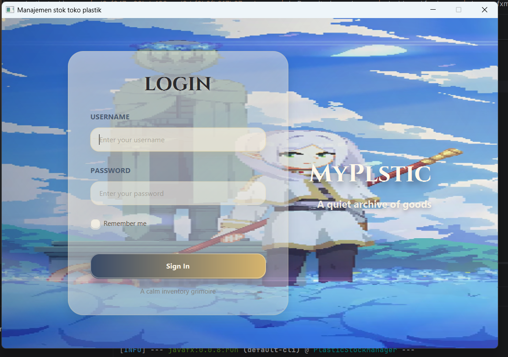
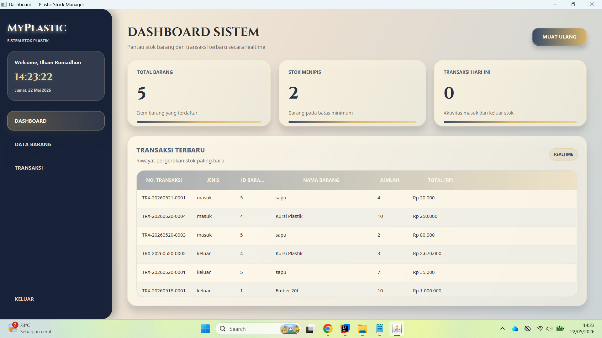
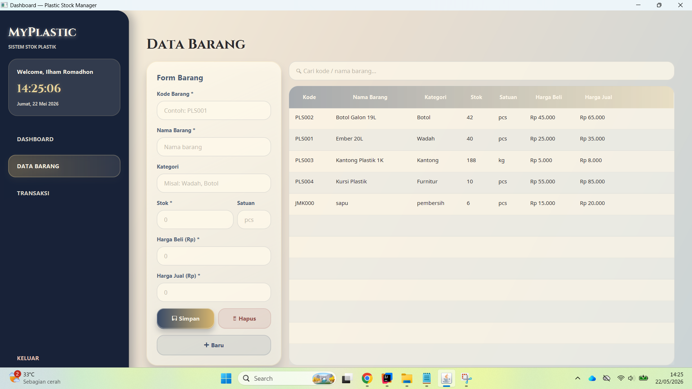
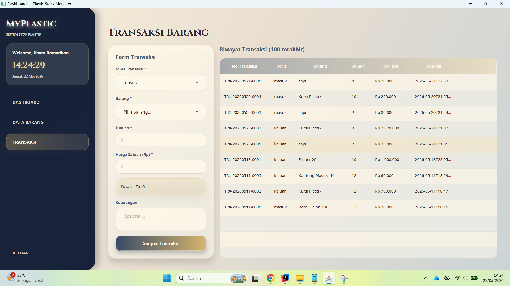

# 🇮🇩 Tentang Aplikasi

MyPlasctick adalah aplikasi desktop sistem manajemen stok plastik berbasis JavaFX yang dirancang untuk membantu operasional toko dalam mengelola stok dan transaksi secara lebih modern, terstruktur, dan efisien.

Aplikasi ini menggabungkan sistem operasional toko dengan tampilan UI modern bertema fantasy anime yang terinspirasi dari Genshin Impact dan atmosfer Frieren. Dengan pendekatan desain yang immersive, elegant, dan cinematic, MyPlasctick memberikan pengalaman penggunaan yang lebih nyaman dan tidak monoton dibanding aplikasi operasional konvensional.

Konsep desain aplikasi mengutamakan:
- modern fantasy-inspired UI
- smooth animation
- glassmorphism effect
- elegant dashboard layout
- immersive user experience
- responsive desktop interface

Fitur utama aplikasi:
- manajemen transaksi stok plastik
- dashboard realtime
- visualisasi data modern
- login system
- interactive table view
- smooth UI transition
- responsive fantasy-inspired interface

MyPlasctick dikembangkan menggunakan JavaFX dengan arsitektur MVC agar maintainable, scalable, dan mudah dikembangkan lebih lanjut sesuai kebutuhan operasional toko.

Project ini juga menjadi media pembelajaran dalam pengembangan software desktop modern, UI/UX design, integrasi database, dan penerapan konsep software engineering berbasis Java.

---

# 🇺🇸 About The Application

MyPlasctick is a desktop-based plastic stock management system built with JavaFX to help store operations manage stock and transactions in a more modern, structured, and efficient way.

The application combines store operational systems with a modern fantasy anime-inspired UI influenced by Genshin Impact and the atmosphere of Frieren. Through an immersive, elegant, and cinematic design approach, MyPlasctick provides a more comfortable and visually engaging experience compared to conventional operational software.

The application's design focuses on:
- modern fantasy-inspired UI
- smooth animations
- glassmorphism effects
- elegant dashboard layouts
- immersive user experience
- responsive desktop interface

Main features include:
- plastic stock transaction management
- realtime dashboard updates
- modern data visualization
- authentication system
- interactive table views
- smooth UI transitions
- responsive fantasy-inspired interface

MyPlasctick is developed using JavaFX with an MVC architecture to ensure maintainability, scalability, and future extensibility according to store operational needs.

This project also serves as a learning medium for modern desktop software development, UI/UX design, database integration, and software engineering concepts using Java.

---

# 📸 Application Preview

## Login Screen

  

---

## Dashboard

  

---

## Data Barang

  

---

## Manajemen Transaksi

  

